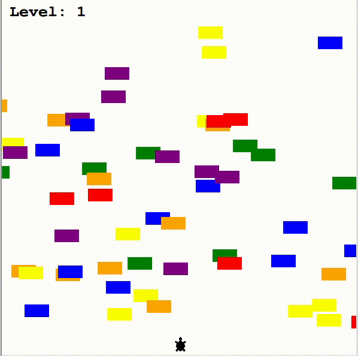

# 
The Turtle Crossing Game

 
 

### 
What is the game image

### 
How to play

<ul style="color:  #e6e600;">
    <li style="list-style: square;">At the beginning of the game the turtle will start at the lower part of the screen in its center</li>
    <li style="list-style: square;">The user will be able to only move forward by pressing the "Up" key in his keyboard</li>
    <li style="list-style: square;">If the turtle manages to get to the other side without hitting any car, then the user will level up and the 
        speed of the cars will increase</li>
    <li style="list-style: square;">If a car hits the turtle then its Game Over </li>
</ul>

